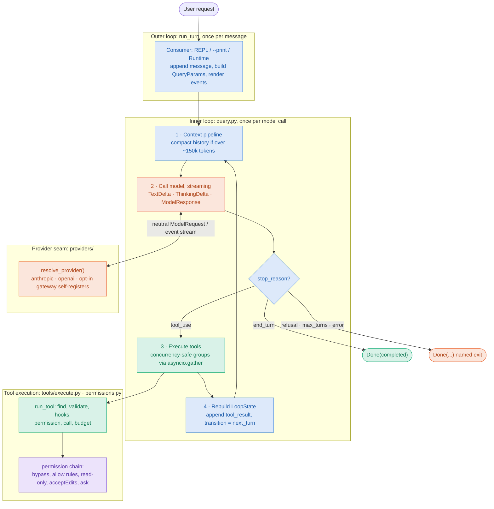

#  tinyorbit

**A tiny harness for building agents.**

tinyorbit is an agent harness. It is the loop, tools, system prompt, and permissions: everything an agent needs except the model. Harness + model = agent. It ships as a small, from-scratch Python coding agent so the harness is real and runnable rather than a diagram. You type a request, it calls the model, runs tools (read/write/edit/bash/glob/grep), and loops until the model stops asking for tools.

The pieces you'd build a different agent from are all seams you can swap: a **provider** layer so any model dialect plugs in (Anthropic and OpenAI ship; a gateway self-registers), an opt-in **tool pool** (sub-agents, skills, MCP servers, hooks), a **permission** chain, and a **Runtime** embedding seam that drives the same loop as a library instead of a terminal.

Roughly 1,600 lines of core code, no required third-party dependency (each model dialect is an optional extra), and its own agent loop that never hands control to a vendor SDK's tool runner. Every non-obvious design choice has a comment pointing at the pattern it demonstrates. [notes.md](notes.md) is a guided walkthrough; the [Architecture](#architecture) section below has the whole picture in one diagram.

## Does it work?

It was run against [SWE-bench Verified](https://www.swebench.com/verified.html) and scored by the official evaluator on 2026-09-13.

| Sample | Instances | Resolved | Cost | Agent time |
|---|---|---|---|---|
| Seed 42, ten of the 500 | 10 | **10 / 10** | $3.39 | 25 min |
| Hard tail, stratified by repo | 10 | **7 / 10** | $10.23 | 53 min |

Both runs used `claude-opus-5` at default effort with a 60-turn cap, one container per task, no retries and a single attempt each. The hard sample was drawn from the 45 instances rated 1 to 4 hours or more, stratified by repository so Django could not dominate.

The same twenty instances were then scored against 19 published leaderboard submissions. On the hard ten the strongest of them resolves 5, and the bash-only mini-SWE-agent reference resolves 2. Every published entry runs a model at least one generation older, so read that gap as model-plus-harness, not as a harness ranking.

Three caveats matter more than the counts. Ten tasks is a small sample: 7/10 carries a 95% interval of roughly 35% to 93%. Frontier models are known to reproduce some Verified gold patches verbatim, so *resolved* does not always mean *reasoned*. And all three misses share one cause: the agent declared success after passing tests it had written itself, rather than deriving a failing reproduction from the issue text first.

[reports/](reports/) holds the full write-ups, both self-contained HTML:

- `swe-bench-report.html`: per-task verdicts, cost and turn behaviour, an analysis of the three misses, and the task-level comparison against published harnesses.
- `agent-loop-trace.html`: one task traced at the wire and replayed. Every stream event across 19 model calls, where adaptive thinking fired and what the socket was doing during it, and how history and the prompt cache behave between turns.

## Running

```bash
uv sync --group dev                    # Python 3.11+, includes the anthropic dialect
export ANTHROPIC_API_KEY=...           # or `ant auth login`

uv run python main.py                              # interactive REPL
uv run python main.py "explain the bootstrap"      # REPL with a first prompt
uv run python main.py --print "list the python files here"   # headless, streams to stdout
uv run pytest                                      # 124 tests, no network
```

Useful flags: `--model`, `--permission-mode {default,acceptEdits,bypassPermissions}`, `--allow 'Bash(git *)'`, `--allowed-tools 'Read,Grep'`, `--disallowed-tools 'Bash,mcp__*'`, `--effort xhigh`, `--max-turns 20`, `--no-fallbacks`, `--thinking-display summarized`, `--resume <id>` (with `--fork` to branch it). Inside the REPL: `/cost`, `/clear`, `/mode`, `/exit`. Ctrl+C mid-turn interrupts the turn; at the prompt it exits.

Defaults: model `claude-opus-5`, adaptive thinking, server-side refusal fallback on, prompt caching on, permission mode `default` (read-only tools run freely, writes and shell commands prompt).

## Architecture

Config and params flow **down**; events stream **up**. Only the model is remote; files, edits, shell, and permissions stay local. Bootstrap builds an immutable `Config` once, a consumer (REPL, `--print`, or the embedding `Runtime`) drives the outer loop one turn per message, and the inner loop in `query.py` runs one cycle per model call until the model stops asking for tools.



The full, annotated version (every named loop exit, the trust boundary, the six tools plus opt-in slots, and the capability subsystems) is a self-contained page: **[reports/architecture.html](reports/architecture.html)**.

## The abstractions (mapped to modules)

| Concept             | Module                        | What it demonstrates |
|---------------------|-------------------------------|----------------------|
| Bootstrap           | `src/tinyorbit/bootstrap.py`      | init → setup → launch; the trust boundary gates reading project files |
| CLI entry           | `main.py`                     | fast path for `--version`/`--help` before heavy imports |
| State               | `src/tinyorbit/state.py`          | session ledger: messages, cost tracker, context size |
| API layer           | `src/tinyorbit/api.py`            | streaming, yield-based retry, cache breakpoints, recoverable-error classification |
| System prompt       | `src/tinyorbit/prompt.py`         | static cached prefix / dynamic boundary |
| Query loop          | `src/tinyorbit/query.py`          | async generator; explicit state reconstruction; terminal vs continue reasons |
| Tool system         | `src/tinyorbit/tools/`            | self-describing tools, fail-closed defaults, input-dependent safety, staleness detection, result budgeting |
| Permissions         | `src/tinyorbit/permissions.py`    | the resolution chain: bypass → rules → read-only → mode → ask |
| Concurrency         | `src/tinyorbit/tools/execute.py`  | consecutive concurrency-safe calls run under `asyncio.gather` |
| Memory              | `src/tinyorbit/memory.py`         | TINYORBIT.md / AGENTS.md from home and every ancestor of cwd |
| REPL / print mode   | `src/tinyorbit/repl.py`           | event rendering, Ctrl+C as abort signal, permission prompts |
| Embedding seam      | `src/tinyorbit/runtime.py`        | drive the loop as a library: a persistent session, events to a caller's sink instead of the terminal |

Built and wired through `Config.capabilities`: sub-agents (a `Task` tool that runs a nested loop in a fresh context; opt-in via `.tinyorbit/agents/*.md`), skills (a `Skill` tool that pulls a named instruction bundle into context; opt-in via `.tinyorbit/skills/`), PreToolUse guard hooks (fail-closed allow/deny/pass policy checks that run before permissions; opt-in via `TINYORBIT_HOOKS` or set by an embedder), and MCP (opt-in via env). Not built yet: the lighter context-management layers (snip/microcompact/collapse). Only auto-compact and reactive compact exist.

## The loop in one screen

```
while True:
    if last request was over the compact threshold:   compact (max 3 failures)
    stream the model
        prompt_too_long  → compact once, retry          (reactive_compact_retry)
        aborted          → Done(aborted_streaming)
        other error      → Done(model_error)
    max_tokens with no tools → retry at 64K once, then nudge "continue" up to 3×
    refusal              → Done(refusal)
    no tool calls        → Done(completed)
    run tools: parallel where every call in the group is concurrency-safe, serial otherwise
        abort mid-batch  → synthesize tool_results for the orphans, Done(aborted_tools)
    max_turns reached    → Done(max_turns)
    state = LoopState(...)   # full reconstruction, transition=next_turn
```

Every `Done` carries the message history, so the caller (REPL or --print) never has to reconstruct it. Every `tool_use` the model emits gets a `tool_result`, even on interruption; that is the invariant the API protocol needs.

## Watching the loop work

Two switches make a run legible. Both are off by default, so neither changes how a benchmark behaves.

```bash
export TINYORBIT_TRACE=/tmp/trace.jsonl        # one JSON line per stream event
uv run python main.py --print --thinking-display summarized "fix the failing test"
```

`--thinking-display summarized` returns the model's reasoning summary. The API omits thinking text by default on this model, so without the flag every thinking block arrives carrying an empty string and the terminal's reasoning renderer never fires. Thinking still happens and is still billed either way.

`TINYORBIT_TRACE` makes the transport append one record per server-sent event: a millisecond offset, the event type, the delta type and its text, plus the shape of the history about to be resent and the usage ledger that comes back. Unset, it costs one environment lookup per call.

Capturing one task showed what the loop looks like from the wire. Nineteen calls over a single reused HTTPS connection. Adaptive thinking firing on five of them and declining on fourteen. Uncached input pinned at exactly 2 tokens on every call while cache reads grew to 12,039. And a thinking pause showing up as 2.6 to 3.9 seconds of silence on an open socket, after which the whole summary arrives in a burst of deltas 0.2 ms apart. The replay is [reports/agent-loop-trace.html](reports/agent-loop-trace.html).

## Testing

`QueryDeps` is the injection seam. Tests pass a scripted `call_model` (a list of canned responses or exceptions) and a fake `compact`, then assert on the event sequence and on the exact request messages the loop would have sent. Tool tests run against a temp directory with real subprocesses. Nothing touches the network.

## Benchmarking

`bench/` runs tinyorbit against SWE-bench Verified, one container per task. It needs Docker with about 30 GB free and an API key. The images are x86_64, so on Apple Silicon they run under emulation.

```bash
cd bench
.venv/bin/python run.py --smoke                        # one container, no key: proves the plumbing
.venv/bin/python run.py --tasks tasks-hard10.json --timeout-min 90
.venv/bin/swebench eval verified -p predictions.jsonl --run-id my-run -j 1
```

Per task it pulls the instance image, copies tinyorbit in, installs it with uv, runs `main.py --print` with the issue as the prompt, captures the transcript and the full message history, takes `git diff` from `/testbed`, and appends a prediction line. Other flags: `--only ID`, `--dry-run`, `--keep`, `--trace`, `--thinking-display`, `--model`, `--effort`, `--max-turns`.

Three frozen task sets ship here so runs are reproducible: `tasks-easy10.json` (seed 42, also the default `tasks.json`), `tasks-hard10.json` (the 1 to 4 h and >4 h tail, stratified by repository), and `tasks-five.json` (an earlier sample, kept for provenance). Run outputs (transcripts, patches, predictions, scoring) stay untracked under `bench/logs/<run-id>/`. See the last section of [notes.md](notes.md) for the method and for what to look for in a failure.

## Layout

```
.
  main.py                  # CLI entry (phase 0 fast path → bootstrap)
  pyproject.toml           # uv project; core has no required dep, each dialect is an optional extra
  src/tinyorbit/
    bootstrap.py  api.py  query.py  state.py  prompt.py  memory.py  permissions.py  repl.py
    runtime.py             # embedding seam: drive the loop as a library
    providers/             # model transport seam
      base.py              # Provider contract, registry, capabilities
      anthropic.py  openai.py   # the shipped dialects
    tools/
      base.py              # Tool, ToolResult, ToolUseContext, schema check
      file_tools.py        # Read, Write, Edit
      bash_tool.py         # Bash + read-only classifier
      search_tools.py      # Glob, Grep
      execute.py           # the pipeline, concurrency partition, orphan safety net
      registry.py  task_tool.py  skill_tool.py
    agents.py  skills.py  hooks.py  sessions.py   # opt-in subsystems
    mcp/                   # external MCP tool servers (opt-in)
  tests/                   # scripted-model loop tests + tool/provider/subsystem tests, no network
  bench/                   # SWE-bench runner: run.py, prompt.txt, frozen task sets
  reports/                 # architecture.html + HTML write-ups of the benchmark runs, and their data
```

## Contributing

Setup, the constraints this project holds itself to, and how the tests work are in
[CONTRIBUTING.md](CONTRIBUTING.md). In short: `uv sync --group dev`, then `uv run pytest` and
`uv run ruff check .`. Neither needs an API key or network access.

## Security

tinyorbit edits files and runs shell commands with arguments chosen by a language model. Before
running it anywhere that matters, and especially before using `--permission-mode bypassPermissions`,
read [SECURITY.md](SECURITY.md) for the trust model and how to report a vulnerability privately.

## License

[MIT](LICENSE). Copyright (c) 2026 badlogicmanpreet.
